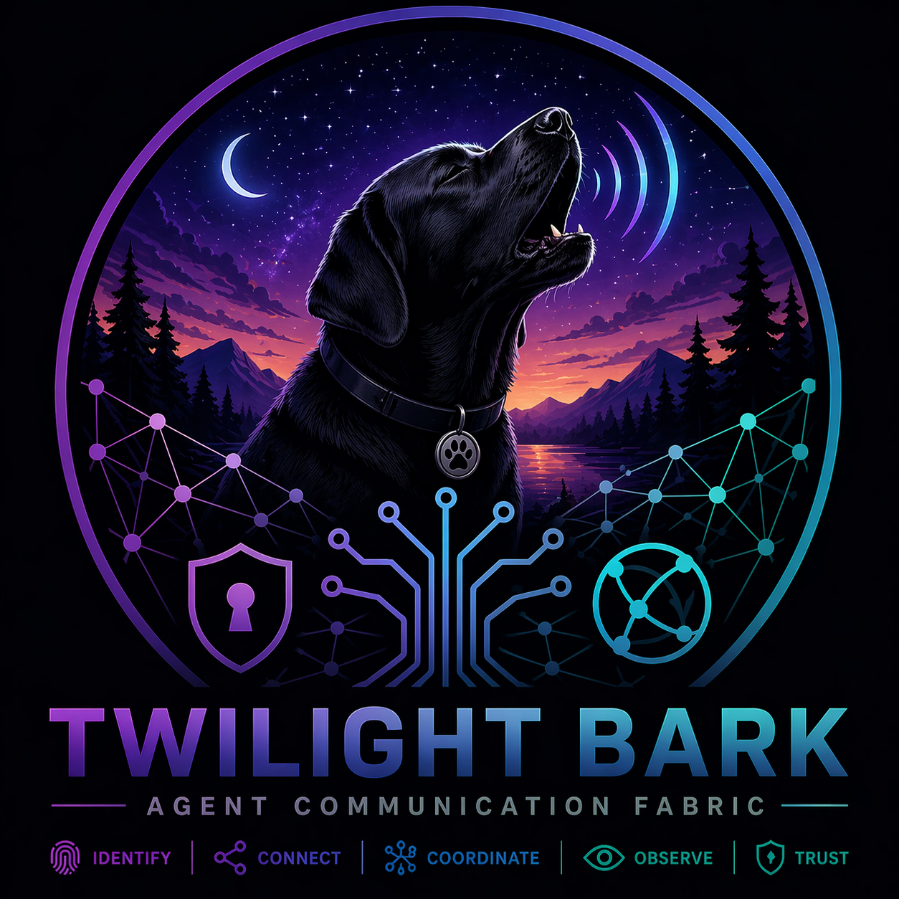

<p align="center">
  
</p>

# Twilight Bark

[](LICENSE)
[](https://zenoh.io)
[](https://www.rust-lang.org)
[](https://modelcontextprotocol.io)

**Twilight Bark** is a distributed agent communication fabric designed for high-performance, observable, and multi-tenant agent coordination. Built on **Zenoh 1.9 (Longwang)** and **Protobuf**, it provides a robust infrastructure for agents to discover each other, exchange tasks, and share observations across heterogeneous environments.

## Core Concepts

- **Agent Identity**: Every participant in the fabric has a cryptographic-grade UUID and role-based identity.
- **The Bus**: A Zenoh-powered transport layer that handles real-time pub/sub and distributed queries across edge, fog, and cloud.
- **Traffic Controller**: A decentralized registry and routing engine that tracks agent presence and directs message flow with minimal latency.
- **MCP Native**: Out-of-the-box support for Model Context Protocol (MCP), allowing AI agents to interact with the fabric as a suite of tools.

## System Architecture

Twilight Bark is organized into a modular Rust workspace:

- `twilight-bus`: Low-level Zenoh integration and transport.
- `twilight-traffic-controller`: Registry management and routing logic (Unicast, Multicast, Broadcast).
- `twilight-mcp-server`: Gateway for LLM-based agents to interact with the fabric via standardized tools.
- `twilight-eventlog`: High-fidelity JSONL logging for all fabric traffic, designed for post-analysis and auditing.
- `adapters/`: Specialized connectors for external systems (e.g., Filesystem, Obsidian).

## Getting Started

### Heartbeat Automation

To keep your agent "Online" without manual plumbing, use the built-in heartbeat utility:

```rust
use std::sync::Arc;
use twilight_bus::TwilightBus;

#[tokio::main]
async fn main() -> Result<()> {
    let bus = Arc::new(TwilightBus::new("default", "local").await?);
    let node_id = "my-agent-01".to_string();
    
    // Starts a background task that sends heartbeats every 10 seconds
    let hb_task = Arc::clone(&bus).start_heartbeat_loop(node_id, 10);
    
    // ... agent logic ...
}
```

### Prerequisites

- [Rust](https://rustup.rs/) (latest stable)
- [Zenoh Router](https://zenoh.io/docs/getting-started/installation/) 1.1-alpha (optional for full mesh capabilities)

### Build

```bash
cargo build --workspace
```

### Usage

1. **Start a Traffic Controller Node**:
   ```bash
   cargo run -p twilight-cli -- start-node
   ```

2. **Connecting Agents**:
   Agents use the `twilight-mcp-server` to join the fabric. Configure your MCP client to point to the server binary.

## Observability

Twilight Bark prioritizes observability. 

1. **Event Logging**: All traffic is logged to structured JSONL files via `twilight-eventlog`.
2. **NuZe Visualization**: Real-time traffic can be monitored using `NuZe` (Nushell). Use the following command to see live messages:
   ```nushell
   sub "twilight/**/signal/**" | from json | table
   ```

## Roadmap

See [ROADMAP.md](ROADMAP.md) for the strategic vision and upcoming features.

## License

MIT / Apache 2.0
