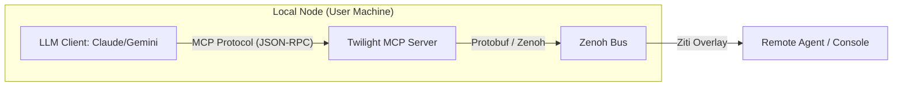

# Twilight Bark: MCP & A2A Integration Architecture

This document explains how LLMs (Claude, Gemini, LM Studio) interact with the Twilight Bark fabric using the **Model Context Protocol (MCP)** and the **A2A Coordination Protocol**.

## 1. The Bridge Pattern
The **Twilight Bark MCP Server** acts as a stateless bridge between an LLM client and the Zenoh bus.

## 2. Server per Client or Shared?
- **Recommendation**: **One MCP Server per Machine (Site)**.
- **Port Management**: The MCP server can expose multiple "Agents" as distinct MCP resources or tools, or multiple LLM clients can connect to the same server if it supports multi-session (though standard MCP is typically 1:1 or stdio).
- **Multiple Providers**: If you have Gemini and Claude running, they both point to the same Twilight MCP server (e.g., `localhost:7447`).

## 3. A2A over the Bus
**Yes, all A2A messages flow over the bus**. 
When an LLM wants to "talk" to another agent:

1.  **Tool Call**: LLM calls `send_task(target_uuid: "boxer-01", operation: "analyze")`.
2.  **Bridge**: The Bridge translates this into a `TaskRequest` envelope.
3.  **Fabric**: The envelope is published to `twilight/.../traffic/...`.
4.  **Target**: The target agent (which also has a Bridge or is a native Twilight agent) receives the request and processes it.
5.  **Result**: The result flows back as a `TaskResult` and is presented to the LLM as a tool response.

## 4. Standard Twilight MCP Toolset
To make this work, the Twilight MCP Server exposes these standard tools:

- `list_fabric_agents()`: Returns a list of all online agents (discovered via presence).
- `dispatch_task(target, cmd, data)`: Sends an asynchronous task.
- `get_task_status(task_id)`: Polls for completion.
- `broadcast_signal(signal_name, body)`: Sends a lightweight signal to all agents.

## 5. Security (Zero-Trust)
Because the Bridge relies on the local **Twilight Console** or **Tunneler** for connectivity:
- The LLM doesn't need Ziti credentials.
- The **Bridge** uses the local Ziti identity.
- Every message the LLM sends is automatically signed and encrypted by the overlay.
