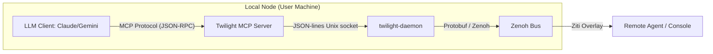

# Twilight Bark: MCP & A2A Integration Architecture

This document explains how LLMs (Claude, Gemini, LM Studio) interact with the Twilight Bark fabric using the **Model Context Protocol (MCP)** and the **A2A Coordination Protocol**.

## 1. The Bridge Pattern
The **Twilight Bark MCP Server** acts as a stateless bridge between an LLM client and the local `twilight-daemon`.
The daemon owns the Zenoh session, OpenZiti sidecar, registry, heartbeat loop, and task routing.

```mermaid
graph LR
    subgraph "Local Node (User Machine)"
        LLM[LLM Client: Claude/Gemini] -- "MCP Protocol (JSON-RPC)" --> Bridge[Twilight MCP Server]
        Bridge -- "JSON-lines Unix socket" --> Daemon[twilight-daemon]
        Daemon -- "Protobuf / Zenoh" --> Bus[Zenoh Bus]
    end
    Bus -- "Ziti Overlay" --> Remote[Remote Agent / Console]
```

## 2. Server per Client or Shared?
- **Recommendation**: **One MCP Server per Machine (Site)**.
- **Port Management**: The MCP server can expose multiple "Agents" as distinct MCP resources or tools, or multiple LLM clients can connect to the same server if it supports multi-session (though standard MCP is typically 1:1 or stdio).
- **Multiple Providers**: If you have Gemini and Claude running, they both point to the same Twilight MCP server (e.g., `localhost:7447`).

## 3. A2A over the Bus
**Yes, all A2A messages flow over the bus**. 
When an LLM wants to "talk" to another agent:

1.  **Tool Call**: LLM calls `send_task(target_uuid: "boxer-01", operation: "analyze")`.
2.  **Bridge**: The Bridge forwards the command to the daemon over IPC.
3.  **Daemon**: The daemon translates this into a `TaskRequest` envelope.
4.  **Fabric**: The envelope is published to `twilight/.../traffic/...`.
5.  **Target**: The target agent (which also has a Bridge or is a native Twilight agent) receives the request and processes it.
6.  **Result**: The result flows back as a `TaskResult` and is presented to the LLM as a task event.

## 4. Standard Twilight MCP Toolset
To make this work, the Twilight MCP Server exposes these standard tools:

- `get_registry()`: Returns all currently registered agents.
- `publish_task(operation, input_json)`: Broadcasts an asynchronous task.
- `ask_agent(agent_uuid, operation, input_json)`: Sends an asynchronous task to one agent.
- `get_pending_tasks()`: Drains pushed `task_request` and `task_result` events.
- `list_tasks()`: Lists daemon-tracked in-flight tasks.
- `reply_task(task_id, output_json, success)`: Replies to an incoming task request.

## 5. Sub-Agent Tracking
Twilight Bark treats every active entity as a first-class participant.

- **Granular ID**: Sub-agents (like `Claude-Cowork`) should generate their own `node_uuid` or use a suffix (e.g., `primary-agent:coworker-1`).
- **Activity Monitoring**: The **Monitor** tab in the Console tracks messages by `agent_name`. When a sub-agent speaks, its distinct name is recorded, allowing for deep audit logs of coordination chains.
- **Traceability**: `correlation_uuid` and `causation_uuid` in the envelope ensure that even complex sub-agent interactions can be reconstructed into a single causal tree.

## 6. Security (Zero-Trust)
Because the Bridge relies on the local **twilight-daemon** for connectivity:
- The LLM doesn't need Ziti credentials.
- The **daemon** uses the local Ziti identity.
- Every message the LLM sends is automatically signed and encrypted by the overlay.
